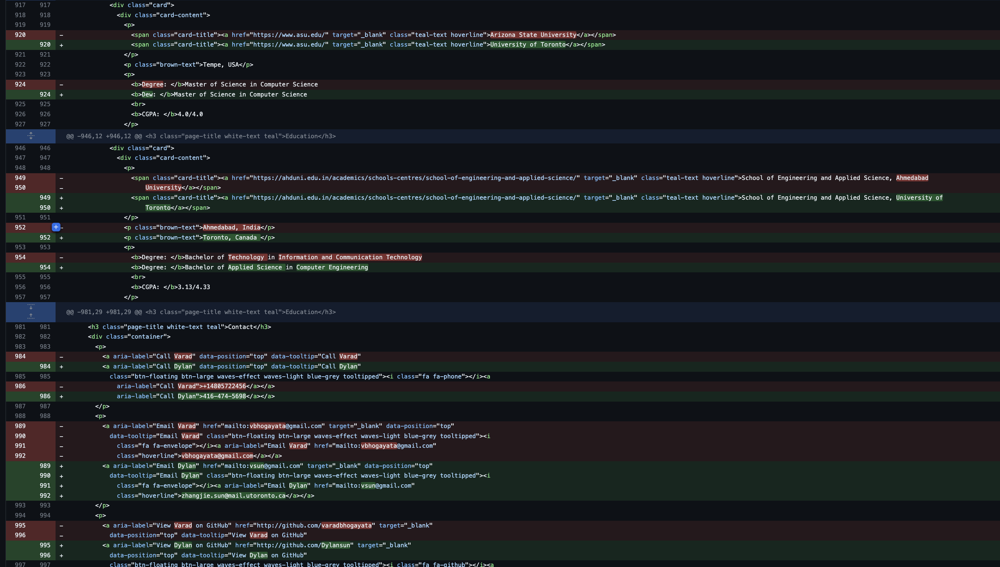

## Dylan Sun

this repo is a clone of
https://github.com/varadbhogayata/varadbhogayata.github.io 

## Activity 1
### screen shot of repo 

## Activity 2
### examples of changes made to repo 

### second round of revisions

### more revisions were made, they were not all recorded, please check commit history 
did not end up changing every single facet (some parts are still the same)
made a best attempt effort to adjust most that I could 
### final deployed home page (did not increase my profile photo for privacy reasons)

## Activity 3
### change repo scheme from green to blue 

### more changes to back ground color etc

### final color of web page demo 

## Activity 4
### nav bar component 1 on repo 

### small nav bar component 2 on repo 

### page embed in repo 

### final screen shots of results on webpage 

### final image to show compressed nav is also edited 
